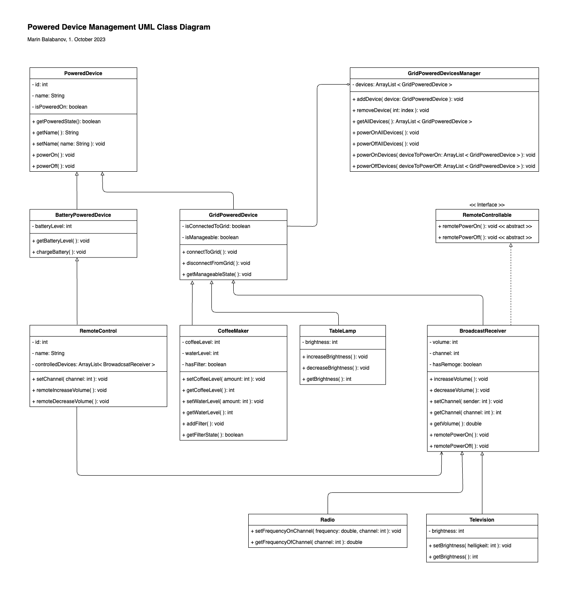

# Devices UML Class-Diagram
 
This is a class diagram describing a system of device power management system. Each powered device can be powered on and off individually. Additionally, a device manager can power multiple/all devices on and off. Broadcast devices can be controlled by a remote control.

There are four classes of powered devices:
- CoffeeMaker
- TableLamp
- Radio
- Television

All devices classes are subclasses of the super-class PoweredDevices. The classes for Radio and Television inherit the class BroadcastDevices, which in turn inherits the super-class PoweredDevice. The BroadCastDevice class also implements the interface RemoteControllable.

